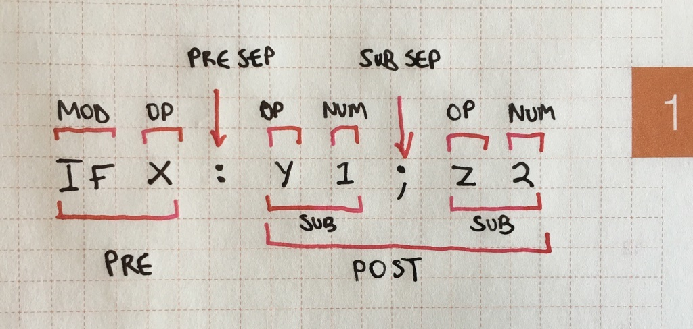

# Advanced

## Teletype terminology

Here is a picture to help understand the naming of the various parts of a Teletype command:



`COMMAND`

: The entire command, e.g. `IF X: Y 1; Z 2;`.

`PRE`

: The (optional)  part before the _`PRE SEP`_, e.g. `IF X`.

`POST`

: The part after the _PRE SEP_, e.g. `Y 1; Z 2`.

`SUB`

: A sub command (only allowed in the _`POST`_), e.g. `Y 1`, or `Z 2`.

`PRE SEP`

: A _colon_, only one is allowed.

`SUB SEP`

: A _semi-colon_, that separates sub commands (if used), only allowed in the _`POST`_.

`NUM`

: A number between `−32768` and `32767`.

`OP`

: An _operator_, e.g. `X`, `TR.PULSE`

`MOD`

: A _modifier_, e.g. `IF`, or `L`.

## Sub commands

Sub commands allow you to run multiple commands on a single line by utilising a semi-colon to separate each command, for example the following script:

```
X 0
Y 1
Z 2
```

Can be rewritten using sub commands as:

```
X 0; Y 1; Z 2
```

On their own sub commands allow for an increased command density on the Teletype. However when combined with `PRE` statements, certain operations become a lot easier.

Firstly, sub commands cannot be used before a `MOD` or in the `PRE` itself. For example, the following is **not allowed**:

```
X 1; IF X: TR.PULSE 1
```

We can use them in the `POST` though, particularly with an `IF`, for example:

```
IF X: CV 1 N 60; TR.P 1
IF Y: TR.P 1; TR.P 2; TR.P 3
```

Sub commands can also be used with `L`, though due to (current) limitations on how many separate numbers, `OP`s and `MOD`s are allowed in a single command this can be tricky (even if you can fit the text on a line).

## Aliases

In general, aliases are a simple concept to understand. Certain `OP`s have been given shorted names to save space and the amount of typing, for example:

```
TR.PULSE 1
```

Can be replaced with:

```
TR.P 1
```

Where confusion may arise is with the symbolic aliases that have been given to some of the maths `OP`s. For instance `+` is given as an alias for `ADD` and it _must_ be used as a direct replacement:

```
X ADD 1 1
X + 1 1
```

The key to understanding this is that the Teletype uses _prefix notation_[^polish] always, even when using mathematical symbols.

[^polish]: Also know as _Polish notation_.

The following example (using _infix notation_) **will not work**:

```
X 1 + 1
```

Aliases are entirely optional, most `OP`s do not have aliases. Consult the `OP` tables and documentation to find them.

## Avoiding non-determinism

Although happy accidents in the modular world are one of it's many joys, when writing computer programs they can be incredibly frustrating. Here are some small tips to help keep things predictable (when you want to them to be):

  1. **Don't use variables unless you need to.**
  
     This is not to say that variables are not useful, rather it's the opposite and they are extremely powerful. But it can be hard to keep a track of what each variable is used for and on which script it is used. Rather, try to save using variables for when you do want non-deterministic (i.e. _variable_) behaviour.
     
  2. **Consider using `I` as a temporary variable.**
  
     If you do find yourself needing a variable, particularly one that is used to continue a calculation on another line, consider using the variable `I`. Unlike the other variables, `I` is overwritten whenever `L` is used, and as such, is implicitly transient in nature. One should never need to worry about modifying the value of `I` and causing another script to malfunction, as no script should ever assume the value of `I`.
     
  3. **Use `PN` versions of `OP`s.**
  
     Most `P` `OP`s are now available as `PN` versions that ignore the value of `P.I`. (e.g. `PN.START` for `P.START`). Unless you explicitly require the non-determinism of `P` versions, stick to the `PN` versions (space allowing).
  
  4. **Avoid using `A`, `B`, `C` and `D` to refer to the trigger outputs, instead use the numerical values directly.**
   
     As `A-D` are variables, they may no longer contain the values `1-4`, and while this was the recommend way to name triggers, it is no longer consider ideal. Newer versions of the Teletype hardware have replaced the labels on the trigger outputs, with the numbers `1` to `4`.
